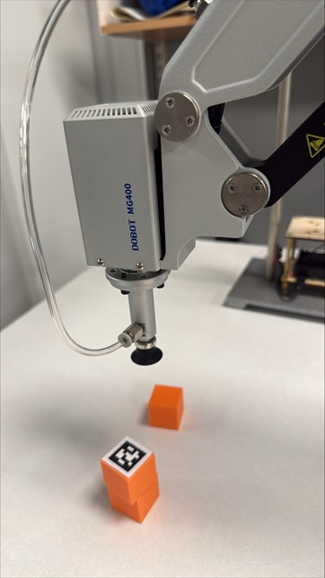

## 25 August 2026 – Testing the Robot Arm Suction Gripper

Today, we connected the suction gripper to the Dobot MG400 robot arm. We placed an orange cube approximately 20 cm in front of the robot and programmed the robot to move above it.

The robot successfully moved to the cube and picked it up using the suction gripper. We repeated the test five times to check the reliability of the gripping operation. All five trials were successful.

**Figure 1:** The Dobot MG400, suction gripper, and orange cubes before testing.

### Conclusion

The suction gripper successfully picked up the cube in all five trials. In the next session, we will use the visual marker to detect the cube and automatically determine its position.