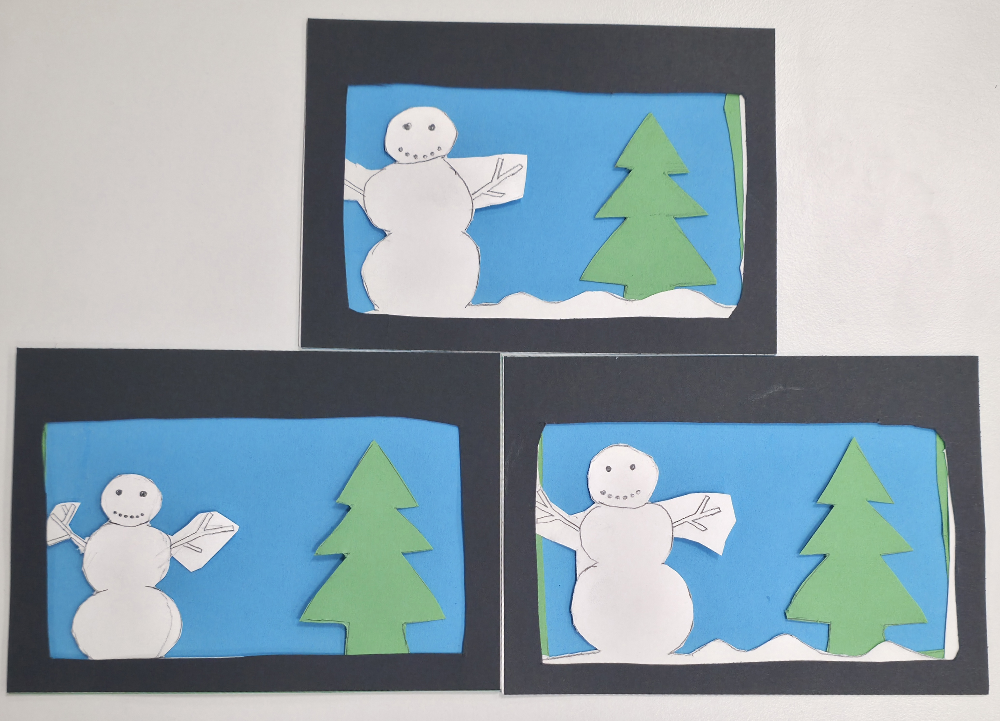
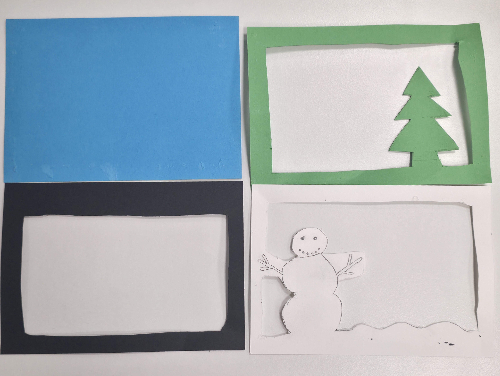
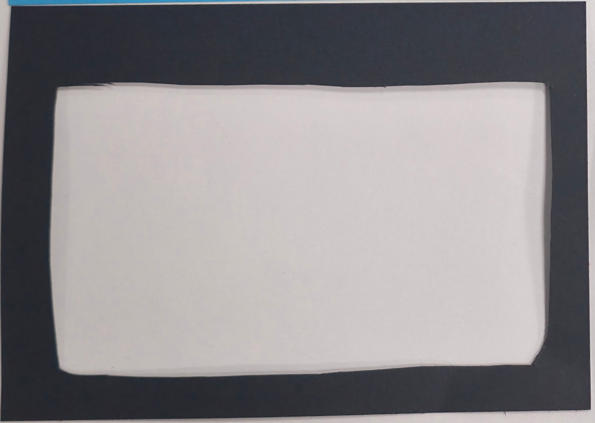
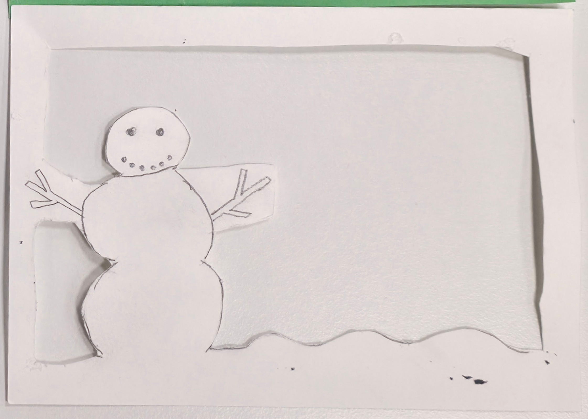
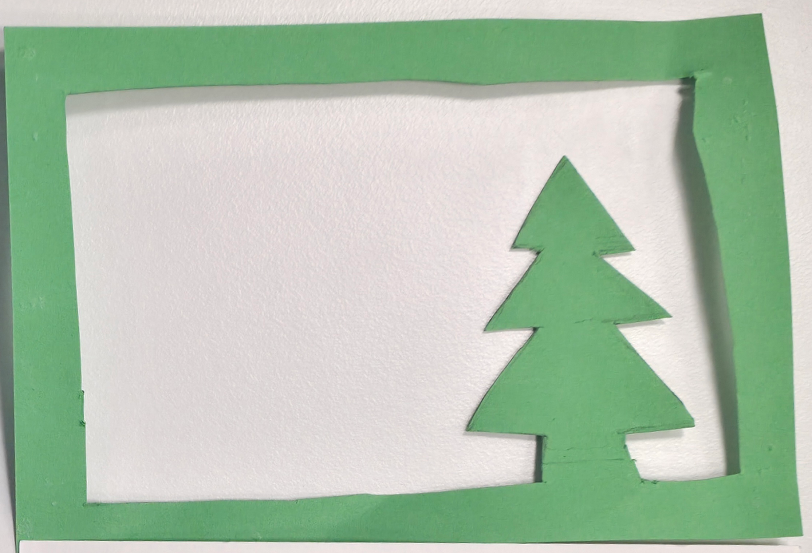
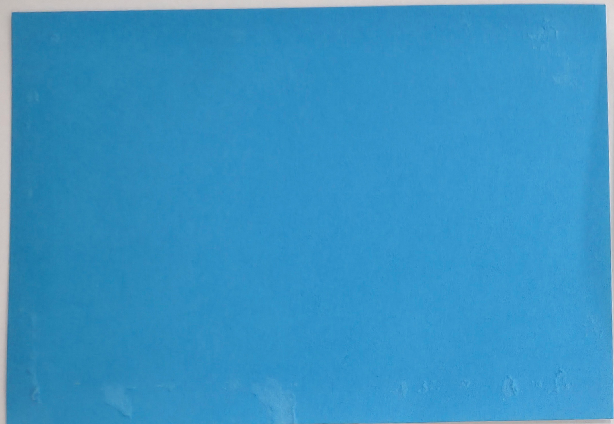

# Documentation

## Team Members

- Peter Šabík
- Marcell Tokay
- Additional help - Boris Belov
## Four-Layer Christmas Cards

### Overview

The cards are constructed of **four** individual and differently coloured layers stacked on top of eachother

### Layer Configuration

The construction consists of the following layers, arranged sequentially from **front to back**:

| Layer | Element | Color | Position |
|---|---|---|---|
| **1** | Frame | Black | Front |
| **2** | Snowman layer | White | Middle 1 |
| **3** | Tree layer | Green | Middle 2 |
| **4** | Background Layer | Blue | Rear |
---

## Layer 1 — Frame

**Position:** Front

**The first layer is the frame of the picture.**

The layer consists of **a rectangular frame**. A basic black frame surrounding the rest of the **card**

---

## Layer 2 — Snowman layer

**Position:** Behind the Frame

The second layer is a cutout of a **snowman**

The snowman has **three** layers, coal smile and eyes and wooden sticks for arms.

This layer also contains **snow** to add more depth to this card.

---

## Layer 3 — Tree layer

**Position:** Behind the snowman

The third layer contains a **pine tree**, that is added to bring more greenery into this Christmas card. 

This layer only consists of a single **green** tree.

## Layer 4 — The background

**Position:** Background

The background only consists od an uncut, blue layer of paper
## Time Table

| Lap | Lap Time |
|:---:|:--------:|
| **1** | +01:01 | 
| **2** | +01:46 |
| **3** | +02.11 |
| **4** | +02.48 |
Time in total : ** 2:48 **
