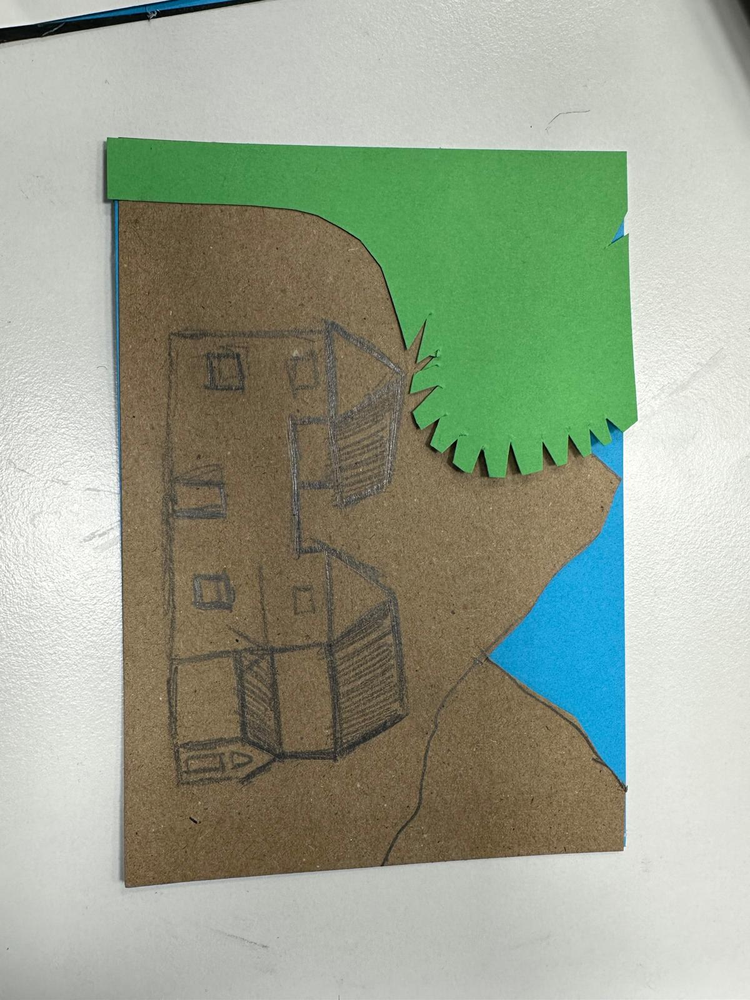
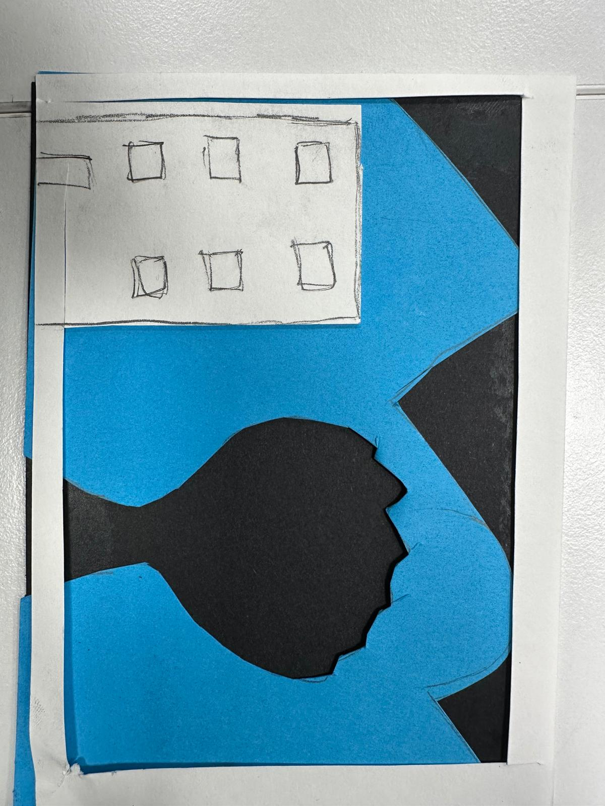
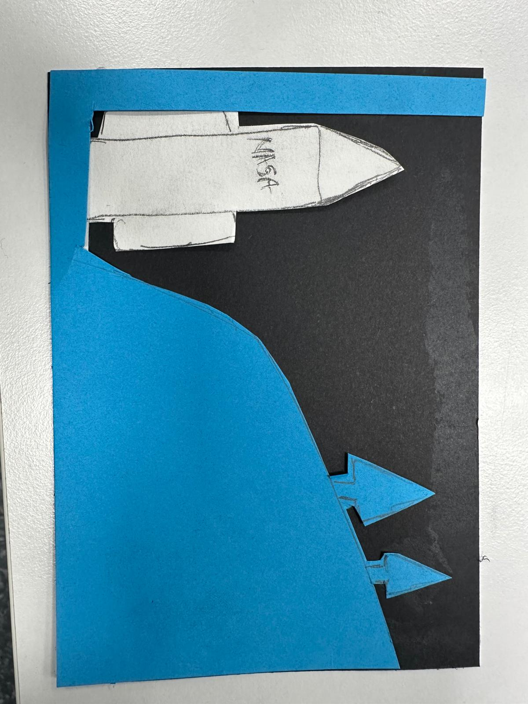

# Engineering Notebook

## Group Information

- **Group number:** Group 1
- **Group name:** HAMK Group1
- **Team members:**Napolyon Ahmed,sudesh sandaruwan
- **Project:** Robot Pick-and-Place

---

## 2026-08-25 – Testing the Robot Gripper

**Present:** Sudesh Sandaruwan and Napolyon Ahmed

### Goal

Create image using by card manually,and measure the time taken by creation.

### Work Completed

We made image using by papers, and cut the image draft and glou in it and past accordingly,and calculate the time take. 

  
1 image time taken 29 seconds
2nd image taken 30 seconds
and 3rd image taken 31 seconds
**Figure 1:** The robot arm and orange cubes before the test.

### Conclusion and Next Step

We have to compare the time consuming by robot to do the same.

---

## References

- [Dobot MG400 website](https://www.dobot-robots.com/)