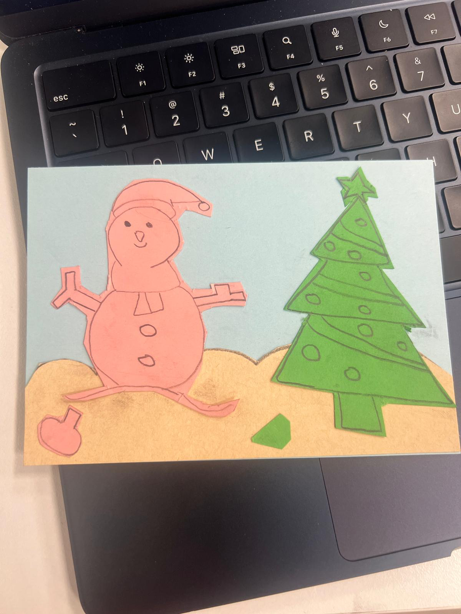
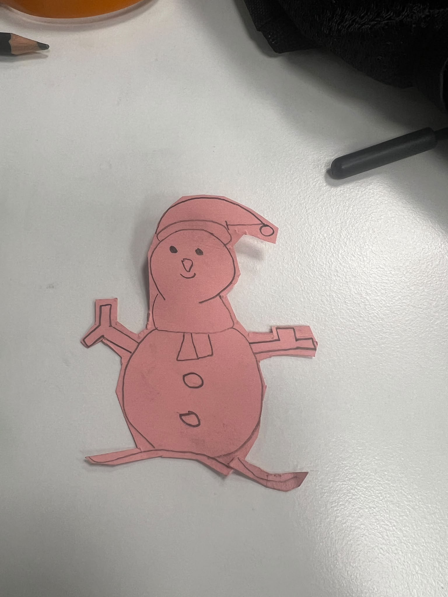
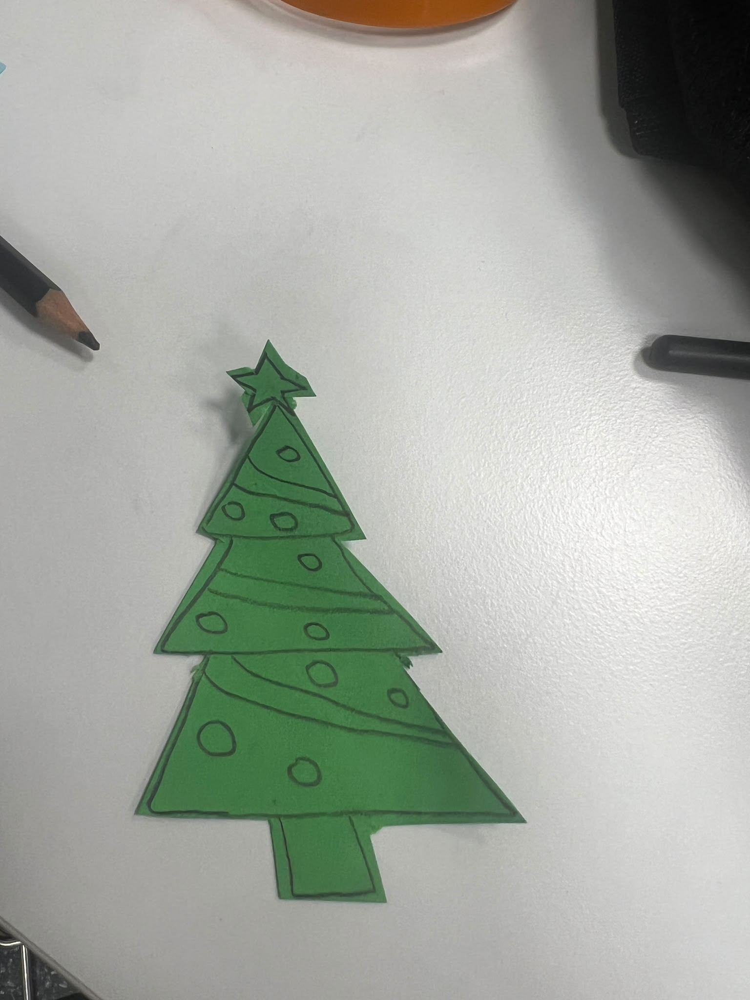
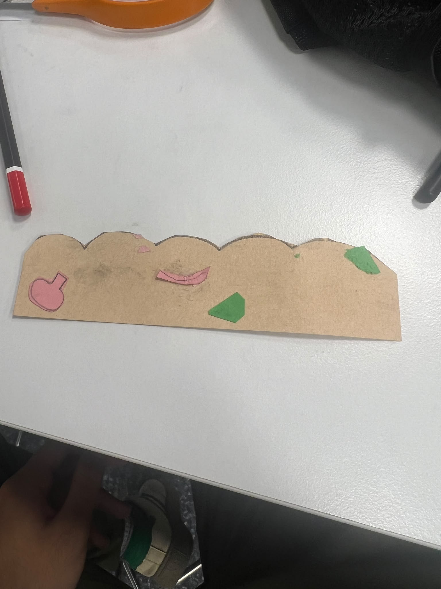

# Engineering Notebook

## Group Information

- **Group number:** Group 10
- **Group name:** Titan Forge
- **Team members:** Sojib, Irfan
- **Project:** Crafting

---

## 2026-09-07 – Manual Assembly Test

**Present:** Sojib, Irfan

### Goal

The goal was to manually assemble a minimum of three objects and measure the time required to complete the task. The results will later be used as a baseline for comparison with the robotic solution.

### Work Completed

We manually assembled the objects and measured the completion time for three attempts.

| Attempt | Time (Minutes) |
|---|---:|
| 1 | 9 |
| 2 | 7 |
| 3 | 5 |

**Minimum:** 5 Minutes 
**Maximum:** 9 Minutes  
**Mean:** 7 Minutes

## Layer 1 — Snowman

## Layer 2 — Christmas Tree

## Layer 3 — Land

### Conclusion and Next Step

The manual assembly test was completed successfully. The measured times will be used as a baseline for comparison with the future robotic solution.

### References

- Lab instructions provided by the lecturer.