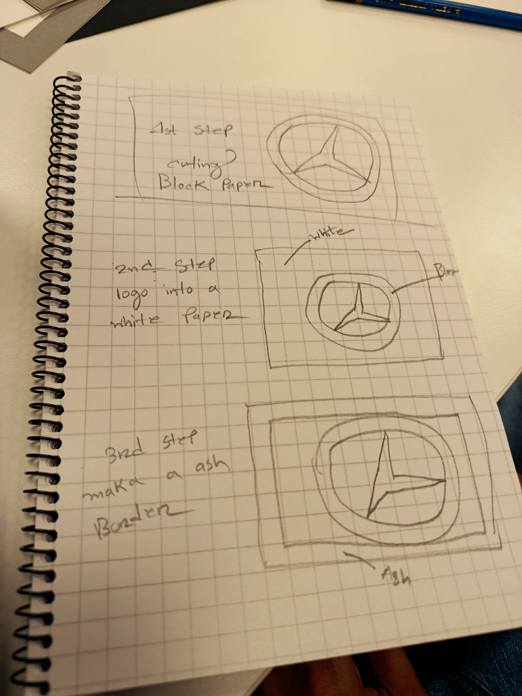
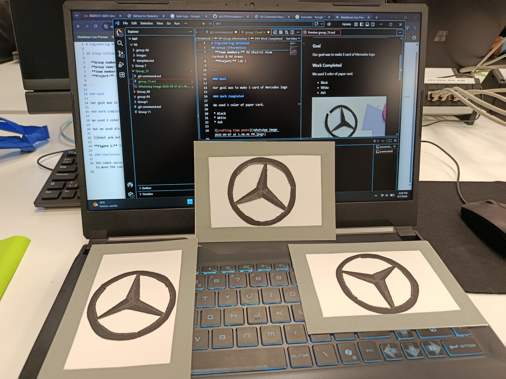

# Engineering Notebook

## Group Information

- **Group number:** Group 15
- **Group name:** RoboGlue
- **Team members:** Md Khairul Alom Fardush & Md Shifat Ul Arman
- **Project:** Lab 1
- **Date:** 07-09-2026
---

### 2026-08-25 – Testing the Robot Gripper

**Present:** Md Khairul Alom Fardush & Md Shifat Ul Arman

### Goal

Our goal was to make 3 card of Mercedes logo

## Work Completed:

### Mapping-1

We make a sample design first for the Mercedes logo within 3 steps.

Here we initially planning what we need to make

### Mapping-2

Then here we make the actuall desgine, which takes 3 steps and we follow all those steps for attatcing all of them as we sketch.

### Cutting:

We used 3 color of paper card.

* Black
* White 
* Ash

First we cut black card for making the shape.

This is our cutting part of the logo

After cutting we use glue for join **Black** logo cutting to add it in the **White** card.

then we make the ash border by cutting the ash card.

### Timing:

For cutting we spend 3 minutes. But we cut 3 black logo together. For each one we need only 1 minute.

For joining all of them we need 73 seconds for each one.

### Final output: 

Here is our final output of 3 cards:

For each card process it takes appro. 2 min 07 sec