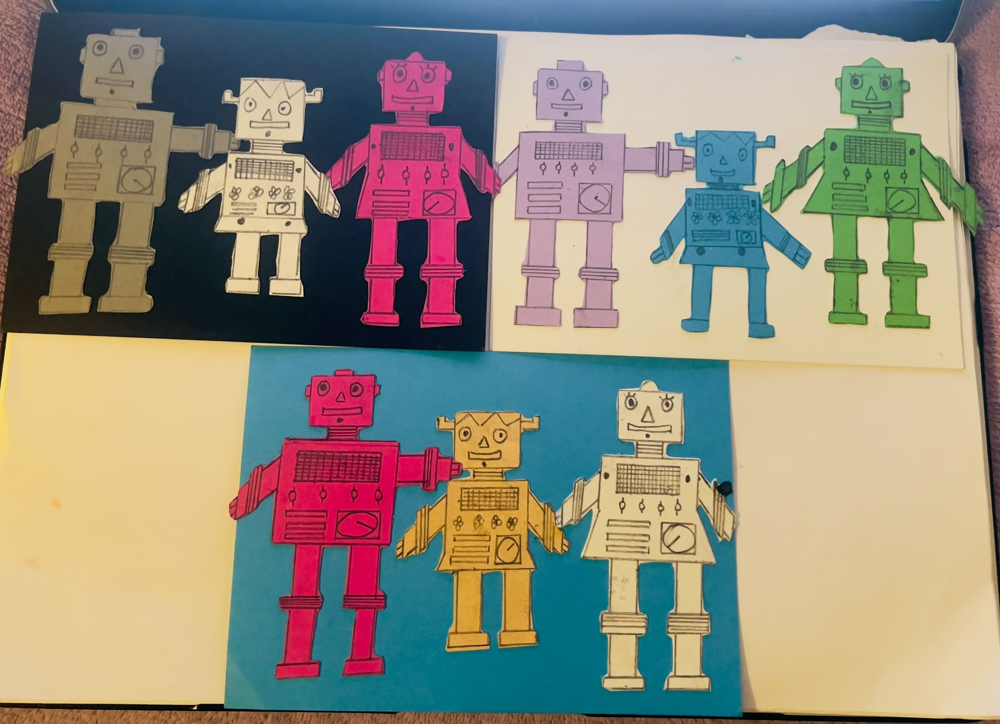
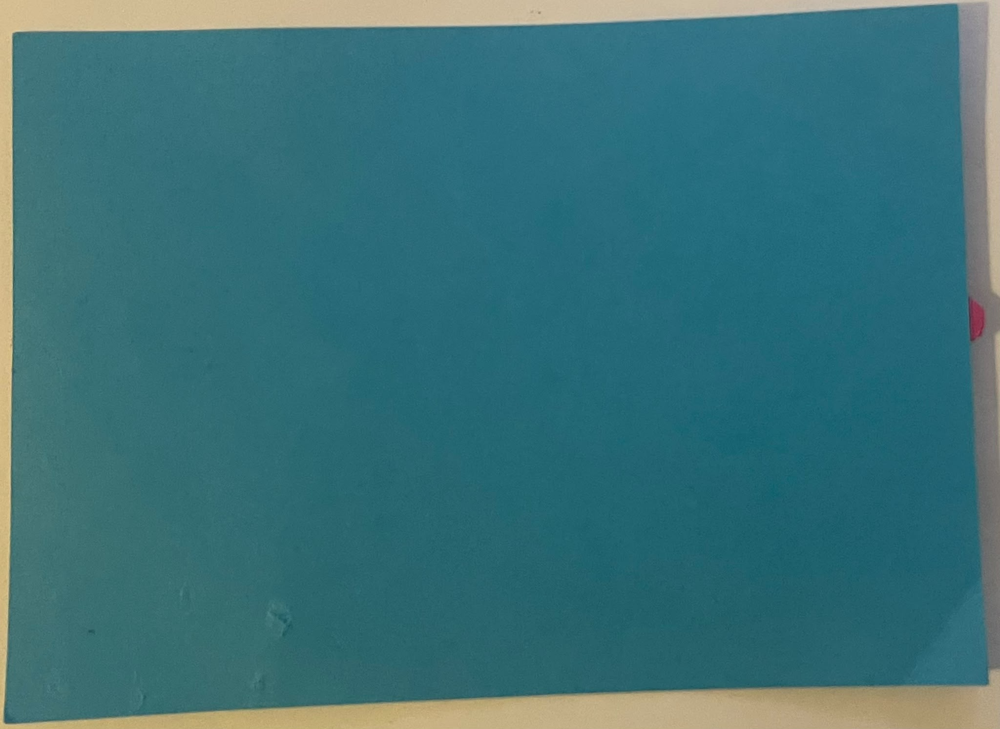
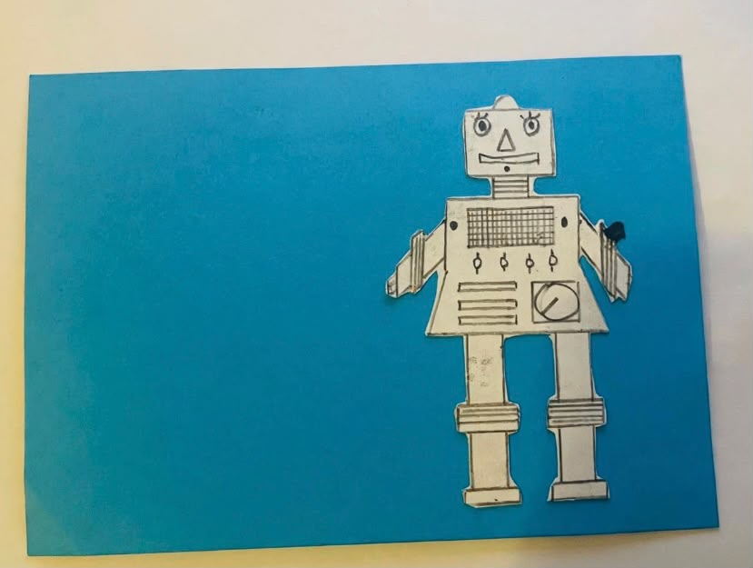
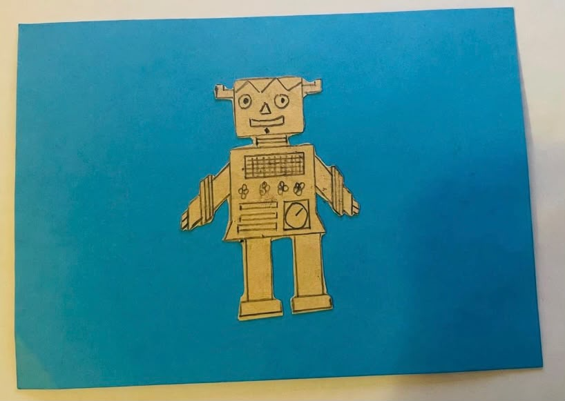
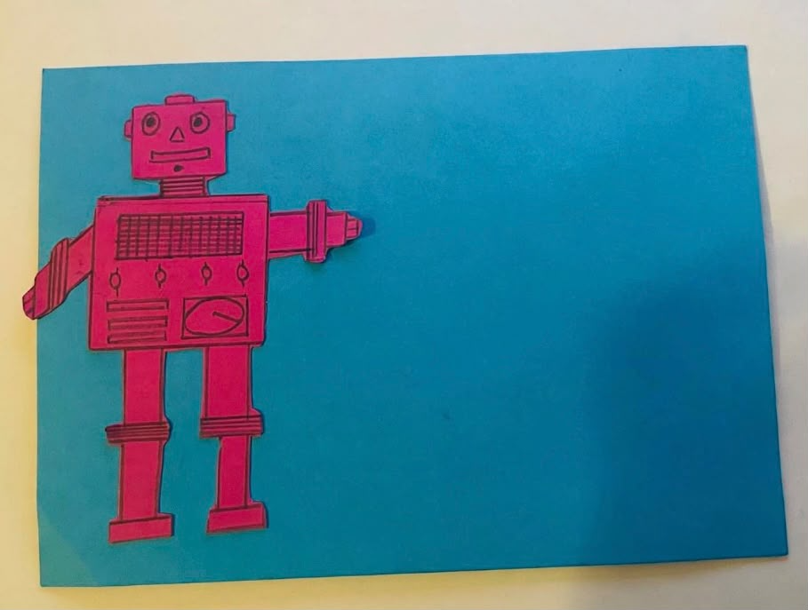

# Documentation

## Team Members

- Milan Thapa
- Sobita Khadka

## Four-Layer Robot Family 

### Overview

[Picture 1]

The cards are constructed of **four** individual and differently coloured layers stacked on top of eachother

## Layer Configuration

<table border="1">
  <tr>
    <th>Layer</th>
    <th>Element</th>
    <th>Color</th>
    <th>Position</th>
  </tr>
  <tr>
    <td><strong>1</strong></td>
    <td>Background Layer</td>
    <td>Sky Blue</td>
    <td>Back</td>
  </tr>
  <tr>
    <td><strong>2</strong></td>
    <td>Mother Robot Layer</td>
    <td>White</td>
    <td>Left Side</td>
  </tr>
  <tr>
    <td><strong>3</strong></td>
    <td>Child Robot Layer</td>
    <td>Yellow</td>
    <td>Middle</td>
  </tr>
  <tr>
    <td><strong>4</strong></td>
    <td>Father Robot Layer</td>
    <td>Pink</td>
    <td>Right Side</td>
  </tr>
</table>

## Layer 1 — Background

[Picture 2]

**Position:** Back side

**The first layer is the Background of the picture.**

The layer consists of **a rectangular Backround**. A basic sky blue background of the **card**

---

## Layer 2 — Mother Robot layer

[Picture 3]

**Position:** Left side of the card

The second layer is a cutout of a **robot**

---

## Layer 3 — Child Robot Layer

[Picture 4]

**Position:** middle of the card

The third layer contains a **child robot**, that is added to bring more beautiful family. 

## Layer 4 — Father Robot

[Picture 5]

**Position:** Right side of the card

## Time Table

<table border="1">
  <tr>
    <th>Lap</th>
    <th>Lap Time</th>
  </tr>
  <tr>
    <td>1</td>
    <td>+04:01</td>
  </tr>
  <tr>
    <td>2</td>
    <td>+07:46</td>
  </tr>
  <tr>
    <td>3</td>
    <td>+10:11</td>
  </tr>
  <tr>
    <td>4</td>
    <td>+10:48</td>
  </tr>
  <tr>
    <th>Total Time</th>
    <th>10:48</th>
  </tr>
</table>