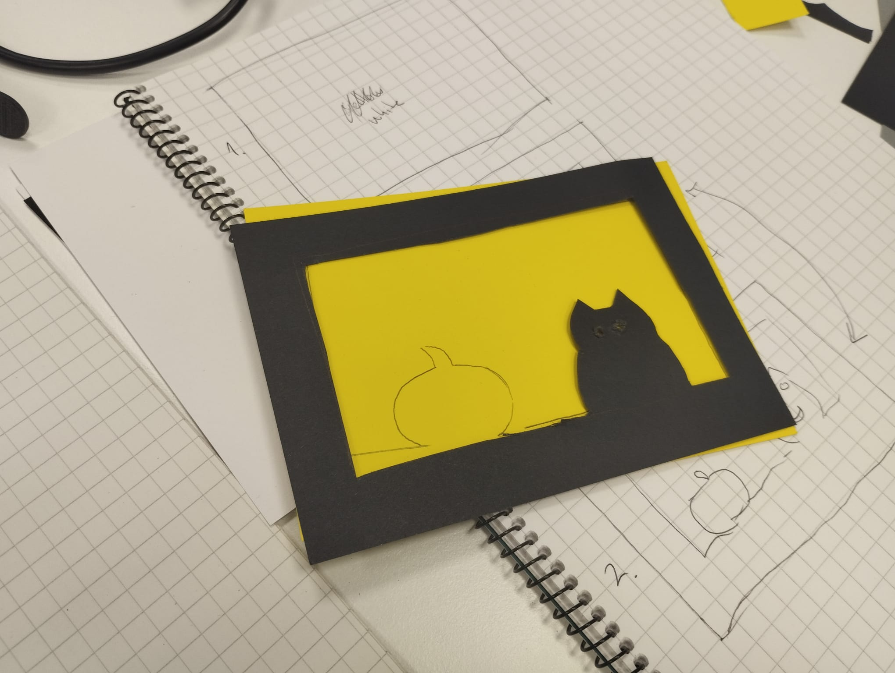
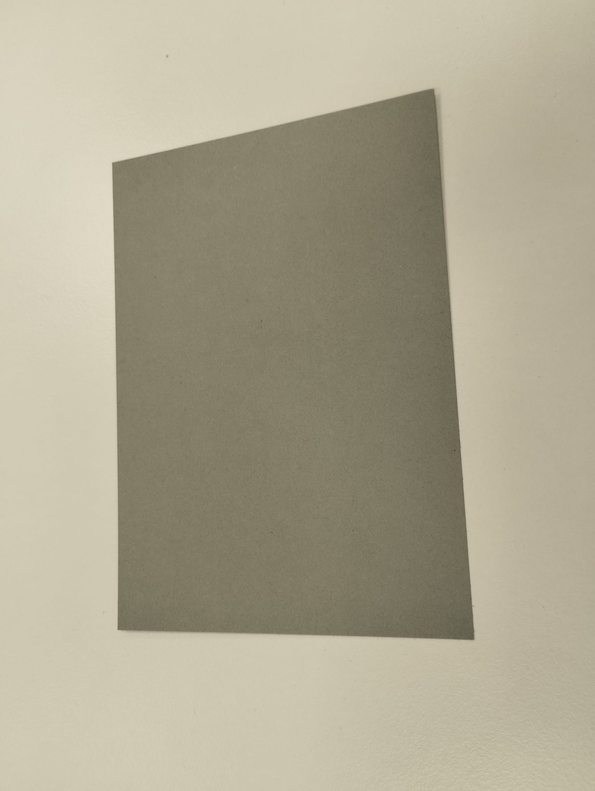

# Documentation

## Team Members

- Arturs Medzevics
- Camilla Roinevirta

## Three-Layer Cardstock Construction

### Overview

The construction consists of **three individual layers of cardstock**, assembled to create a dimensional cat-and-pumpkin composition.

### Layer Configuration

The construction is composed of the following layers, arranged sequentially from **front to back**:

| Layer | Element | Color | Position |
|---|---|---|---|
| **1** | Face Layer | Black | Front |
| **2** | Pumpkin Layer | Yellow | Middle |
| **3** | Background Layer | Grey | Rear |

---

## Layer 1 — Face Layer

**Position:** Front

The first layer forms the **primary visual surface** of the construction.

The layer consists of a **cat-shaped design contained within a rectangular frame**. Selected areas of the cat's face are removed to create openings for the **eyes and mouth**.

---

## Layer 2 — Pumpkin Layer

**Position:** Behind the face layer

The second layer contains the **pumpkin element**.

The pumpkin is positioned so that it **extends into and protrudes visually from the lower portion of the face-layer frame**. This creates the primary dimensional interaction between the first and second layers.

In addition to forming the visible pumpkin, this layer provides the **colour visible through the eye and mouth openings** in the cat's face.

---

## Layer 3 — Background Layer

**Position:** Rear

The third layer consists of a **single, uncut sheet of grey cardstock**.

No shapes, openings, or other cut details are incorporated into this layer.

---

## Time Table

| Lap | Lap Time | Total Time |
|:---:|:--------:|-----------:|
| **1** | +01:33 | 01:33 |
| **2** | +01:41 | 03:14 |
| **3** | +01:51 | 05:05 |
