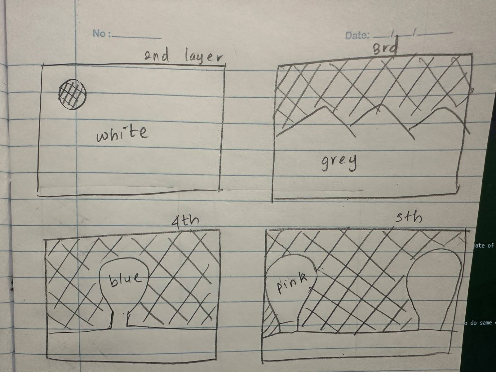
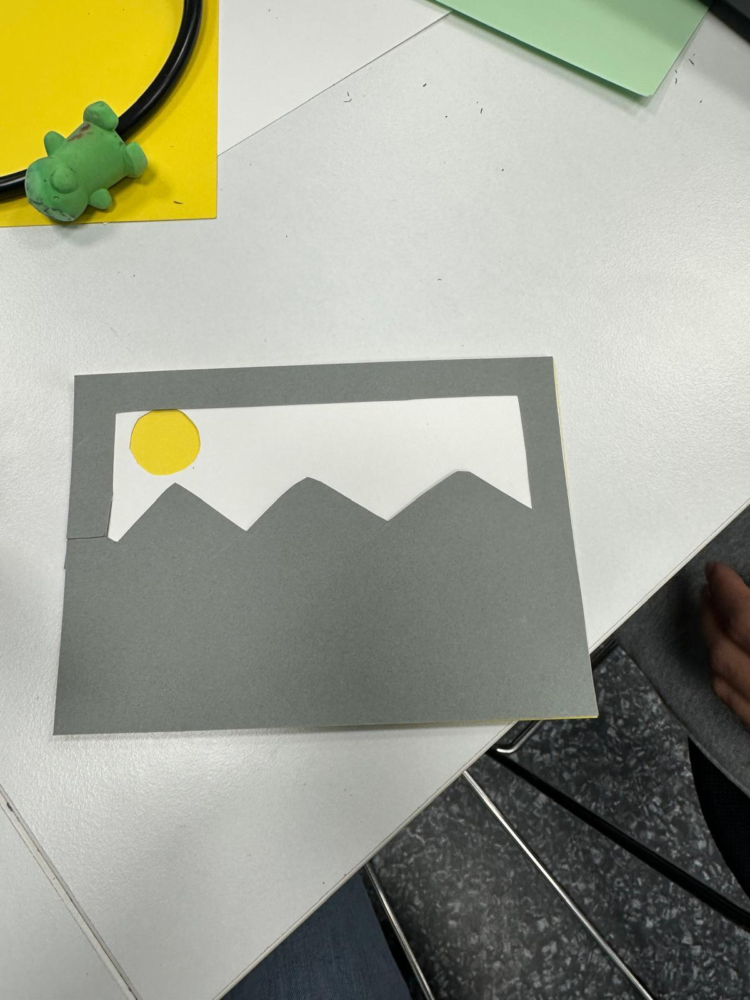
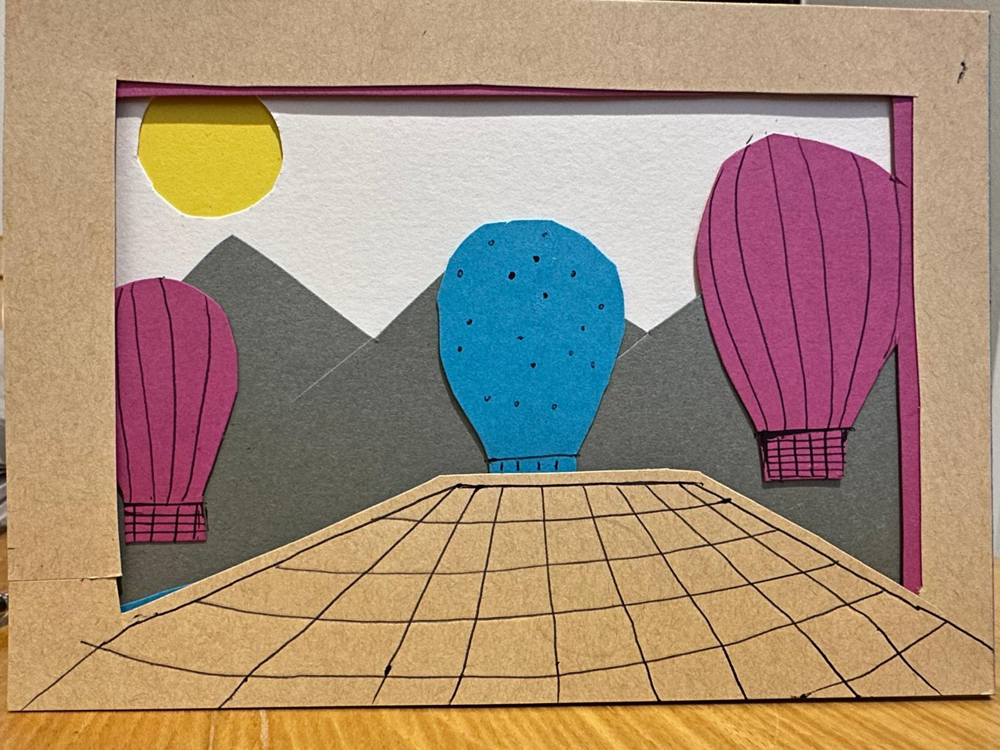

# Engineering Notebook

## Group Information

- **Group number:** Group 1
- **Group name:** Design and Assembling  of 3D card
- **Team members:** Sanduni and Jiang Zengmei
- **Project:** Assembling Project

---

## 2026-09-07 – Design and Assembling of 3D Card

**Present:** Sanduni and Jiang Zengmei

### Goal

Our goal was to design and construct a five-layer 3D card and measure the time required to manually assemble the different components.

### Material and Colour Selection

We first selected the required six colour cards, glue and scissor for creating the 3D picture. The colours were chosen according to the planned balloon scenery and the different elements that needed to be included in the design.

### Design and Planning

We sketched the balloon scenery and planned the overall design before starting the construction. We decided how the picture would be divided into five layers and planned the position of each element. We also planned how each part should be cut and arranged to create a three-dimensional effect.

**Figure 1:** Initial design and planning of the five-layer 3D card.

### Cutting the Colour Cards

After completing the design, we cut the selected colour cards according to the planned shapes and sizes. Each component was prepared carefully so that it could be placed correctly in its respective layer.

### Five Layer Picture

The 3D picture was designed using five layers. Each layer contained different elements of the balloon scenery. The layers were arranged at different positions to create depth and make the picture appear three-dimensional.

### Assembly of the Balloon Scenery

After cutting all the required components, we arranged them according to the planned design. We checked the position and alignment of each component before gluing them together.

### Gluing Process

The layers were glued together one by one. We carefully positioned each card before applying the glue to ensure that the layers were properly aligned and that the final picture had the intended 3D appearance.

**Figure 2:** Assembly of the third card/component during the construction process.

### Time Measurement for Pasting

We measured the time required to manually paste each card during the assembly process. The time taken for each card was recorded separately so that the overall average pasting time could be calculated.

Table 1 : Recorded Time for pasting

| Step | Card Number | Time Recorded | Remarks |
|---|---|---|---|
| 1 | Card 1 | 0 sec | Yellow background |
| 2 | Card 2 | 17 sec | White |
| 3 | Card 3 | 38 sec | Mountain |
| 4 | Card 4 | 45 sec | Blue balloon |
| 5 | Card 5 | 35 sec | Pink balloon |
| 6 | Card 6 | 22 sec | Platform |

### Average Pasting Time

After recording the pasting time for each card, we calculated the average time required to paste one card manually. The average was calculated by adding all the recorded pasting times and dividing the total by the number of cards. The yellow card was used as the background, so its time was not included in the calculation.

Total pasting time = 17 + 38 + 45 + 35 + 22 = **157 seconds**

Number of pasted cards = **5**

Average pasting time = 157 / 5 = **31.4 seconds per card**

Therefore, the average manual pasting time was **31.4 seconds per card**.

### Final Output

The final five-layer balloon scenery was successfully constructed. The recorded time measurements provided an estimate of the average time required for manually pasting the cards.

**Figure 3:** Completed five-layer 3D balloon card.

### Challenges

During the construction process, careful attention was required when cutting and positioning the cards. We had to cut some parts twice, which resulted in additional time being spent.

---

## References

- Project Lead the Way. *Engineering Notebook Basics Video*. Write Out, National Writing Project. Available at: https://writeout.nwp.org/portfolio/engineering-notebook-basics/. Accessed September 7, 2026.

- UNL Spirit Robotics. *Engineering Notebook08*. Available through HAMK Learn: https://learn.hamk.fi/pluginfile.php/1975540/mod_page/content/19/UNL%20Spirit%20Robotics%20Engineering%20Notebook08.pdf. Accessed September 7, 2026.