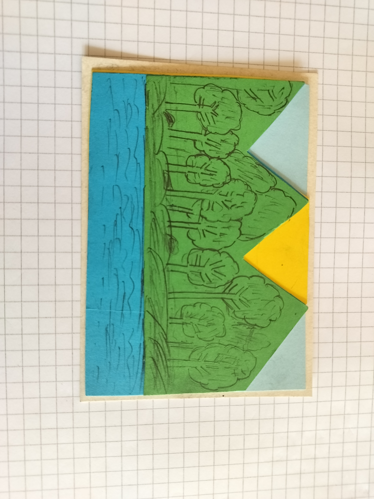
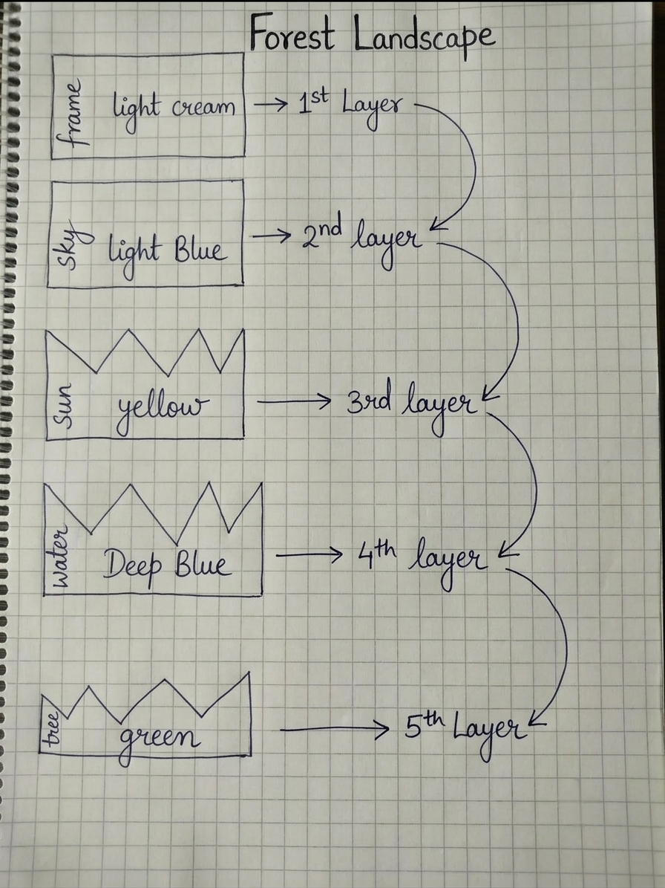
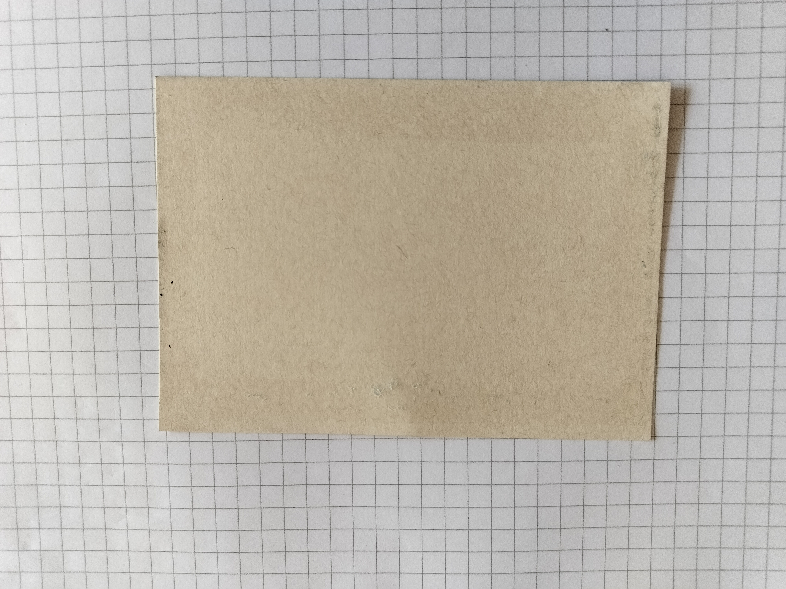
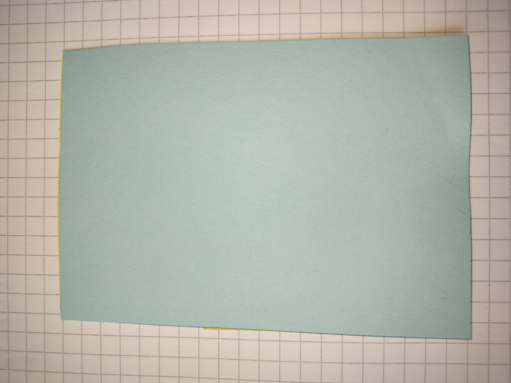
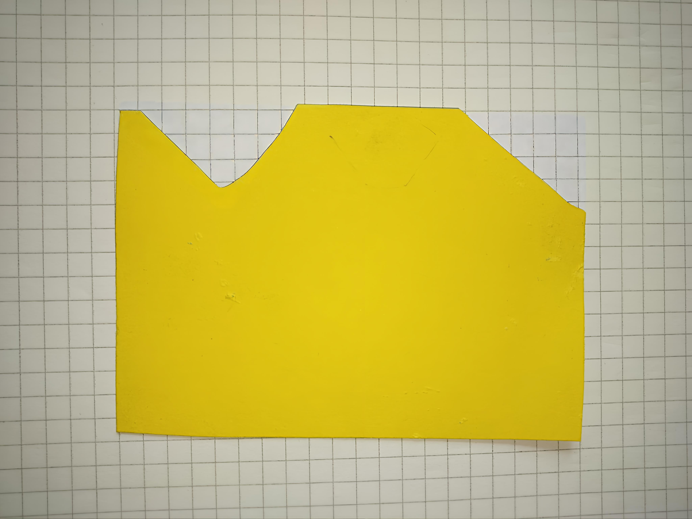
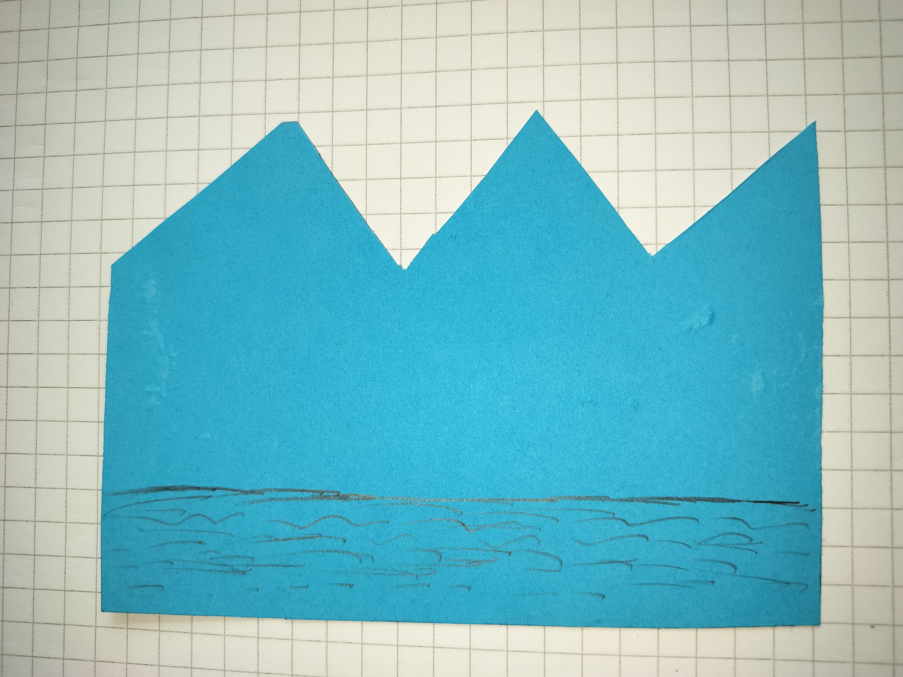

# Engineering Notebook

## Group Information

- **Group number:** Group 08
- **Group name:** Forest landscape
- **Team members:** Jobayear Ahamed, Chandak Priya Darshini,  Vengadabady Vaïshnav
- **Project:** Lab 1
- **Date:** 07-09-2026
---

### 2026-08-25 – Testing the Robot Gripper

**Present:** Jobayear Ahamed, Chandak Priya Darshini,  Vengadabady Vaïshnav

### Goal

Our goal was to make 2 card of of Forest landscape and one Logo 

## Work Completed:

---

## Five-Layer Cardstock Construction

### Overview

The construction consists of **Five individual layers of cardstock**, assembled to create a dimensional Forest Landscape composition.
### Layer Configuration

The construction is composed of the following layers, arranged sequentially from back to front:
| Layer | Element | Color | Position |
|---|---|---|---|
| **1** | Frame | Lite cream | Back |
| **2** | Sky | Light blue | second layer |
| **3** | Sun | Yellow | Third layer |
| **4** | Water | Dark blue | Forth layer |
| **5** | Threes | Green | Front |

## Layer 1 — Frame 

**Position:** Back

This layer **working as a frame** of the construction.

This layer consist a single sheet of light cream paper.

## Layer 2 — Sky

**Position:** On top of first layer

The second layer contains the **A single shit of light blue papaer**.
The light blue layer represents the sky and provides the background for the landscape.

## Layer 3 — Sun

**position:** On top of second layer

The third layer consists of a **single sheet of Yellow paper**.
The yellow cardstock represents the sun. It is positioned behind the forest and mountains.

## Layer 4 — Water

**position:** On top of third layer

The dark blue layer represents the lake at the bottom of the landscape. Lines were added to give the water a textured appearance.

## Layer 5 — Trees

**position:** On top of upper section of fourth layer

The green layer represents the forest and mountains. Trees and other details were drawn onto the cardstock to make the landscape more detailed.

## Construction 2: Logo

### Overview

The second construction is a logo made using three layers of cardstock.

### Layer Configuration
The construction is composed of the following layers, arranged sequentially from front to back:
| Layer | Element | Color | Position |
|---|---|---|---|
| **1** | Frame | Black | Back |
| **2** | Background | Blue | second layer |
| **3** | Logo | pink | Third layer |

### Layer 1: Black Base

The black cardstock forms the outer frame and base of the construction.

### Layer 2: Blue Background

The light blue cardstock is placed inside the black frame and acts as the background.

### Layer 3: Pink Logo

The pink cardstock forms the main logo design. It is placed on top of the blue layer, making it the main visible element.

### Summary

Our group created two different layered cardstock constructions using the same basic principle of arranging multiple pieces to form a complete image.

| Construction | Number of Layers | Main Design |
|--------------|-------------------|-------------|
| 1            | 5                | Landscape   |
| 2            | 3                 | Logo        |

The different colours and layer positions were used to separate the elements of each design and create a clear visual structure.