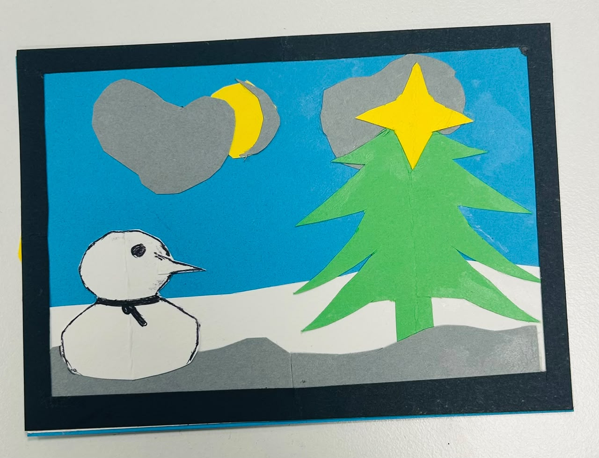

# Engineering Notebook
## Group-11
Group Member :- Adittya dey , Gazi Nafiuzzaman Nafiz
- **Group number:** Group 11
- **Group name:** Group 11 
- **Team members:** Adittya dey , Gazi Nafiuzzaman Nafiz
- **Project:** Lab 1 
---
## 2026-09-07 – Lab 1 
**Present:** Adittya & Nafiz

### Work Completed
During our lab session, we created a Christmas card using different coloured papers and simple craft materials. The main purpose of the activity was to work creatively as a team and learn how to build a project using different materials.

We used white paper to make the snowman, blue paper for the sky, and black paper as a border around the card. We used grey (ash) paper to create the clouds, while yellow paper was used for the stars and moon. We used glue to attach all the different paper pieces together.

By combining these materials, we created a Christmas-themed card. The activity helped us practise teamwork, creativity, planning, and working with different materials to create a final product.For making those card we spent 3 min 50 sec for 1st card , 2 min 40 sec dor 2nd card and 2 min 10 sec for our 3rd card .

**Figure 1:** Chritsmas Card.

